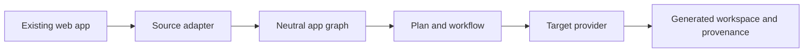

# Navirox

[](https://github.com/guillaume-flambard/navirox/actions/workflows/ci.yml)
[](https://github.com/guillaume-flambard/navirox/actions/workflows/codeql.yml)
[](LICENSE)
[](#status)

**A framework-agnostic toolkit for turning existing web applications into
verifiable native mobile projects. Vue first.**

Navirox is an open-source experiment in a difficult part of web-to-native work:
understanding what can move, refusing what cannot be justified, and keeping a
trace of every generated, manual, and excluded part.



## Status

**Navirox is pre-alpha. There is no supported public npm installation today.**

The repository currently proves several bounded pieces:

- Twelve source adapters detect and inspect Vue, Nuxt, Svelte, SvelteKit,
  Angular, React, Next, Astro, Solid, Qwik, Lit, and vanilla projects.
- The neutral planner records portable, manual, unknown, and refused work.
- A narrow Vue transform generates a compiler-checked workspace with provenance.
- The Vue runtime example is packed outside the monorepo, bundles for both
  platforms, builds on iOS and Android, and runs shared device journeys in CI.

Those facts do not establish arbitrary application conversion, production
readiness, general visual fidelity, or a working `npx navirox` install. The Vue
transform proof compiles generated Vue single-file components. It does not put
that generated workspace into an iOS or Android shell. The separate runtime
example provides the native build and device evidence.

The CI and CodeQL badges show that their workflows ran. They are not a claim
that the codebase has no security findings. See [Security](SECURITY.md) for the
project's current support and disclosure boundaries.

## Try the code from source

Prerequisites: Node.js 22.13 or newer and Corepack. A full native build also
needs the platform toolchains described in [Getting started](docs/GETTING-STARTED.md).

```bash
git clone https://github.com/guillaume-flambard/navirox.git
cd navirox
corepack enable
pnpm install --frozen-lockfile
pnpm build
pnpm test
```

Analyze a supported fixture with the built CLI:

```bash
node packages/cli/dist/bin.js analyze \
  packages/cli/fixtures/vue-transform-workspace/vue \
  --json
```

Run the bounded Vue generation proof:

```bash
node packages/cli/dist/bin.js transform \
  "$PWD/packages/cli/fixtures/vue-transform-workspace/vue" \
  --profile vue-mobile \
  --out /tmp/navirox-vue-preview \
  --write \
  --json
corepack pnpm --dir /tmp/navirox-vue-preview install --ignore-scripts
corepack pnpm --dir /tmp/navirox-vue-preview test
```

This fixture is intentionally small. An unsupported watcher fixture is also in
the repository and proves that the same pipeline refuses incomplete coverage
instead of generating a plausible substitute. The commands and limitations are
recorded in the [Vue transform evidence](docs/evidence/vue-transform-workspace-run.md).

## Architecture

Navirox has two explicit seams:

1. Source adapters understand framework-specific syntax and produce a neutral
   application graph.
2. Target and runtime providers turn a justified workflow into output without
   letting renderer-specific types leak through the public API.

The dependency direction is enforced by tests. Only
`@memolabs-apps/runtime-symbiote` may import the current renderer or React
Native. Application code imports only Navirox packages. Read
[Architecture](docs/ARCHITECTURE.md) for the package boundaries and
[the execution charter](docs/EXECUTION-CHARTER.md) for the current proof rules.

## What is current, and what is historical

The repository contains working code, active specifications, dated evidence,
and earlier design documents. They serve different purposes:

- Code, tests, and fresh CI establish current behavior.
- [The execution charter](docs/EXECUTION-CHARTER.md),
  [proof roadmap](docs/PROOF-ROADMAP.md), and active OpenSpec changes govern
  current work.
- [PLAN.md](PLAN.md), `blueprint.md`, archived OpenSpec changes, release notes,
  and dated evidence preserve decisions and results from their own point in time.

Historical documents are useful context, but they do not override a newer
verification. [The documentation index](docs/README.md) gives each document a
clear place.

## Contributing

Contributions are welcome, especially when they make a claim smaller, a refusal
clearer, or a proof more reproducible. Start with
[CONTRIBUTING.md](CONTRIBUTING.md). If the labelled issue lists are empty, open
a focused issue or use [Discussions](https://github.com/guillaume-flambard/navirox/discussions)
before investing in a large change.

## Project boundaries

Navirox is not presented as a finished migration product. It does not claim a
customer relationship with the public repositories used as benchmarks, nor
permission to reuse their branding, data, or interfaces. External projects are
analysis inputs only, pinned to public revisions and handled under their own
licences.

The most useful public surface is intentionally evidence-led:

- [Getting started from source](docs/GETTING-STARTED.md)
- [Documentation index](docs/README.md)
- [Proof index](docs/evidence/README.md)
- [Security policy](SECURITY.md)
- [Code of conduct](CODE_OF_CONDUCT.md)

## License

MIT. See [LICENSE](LICENSE).
